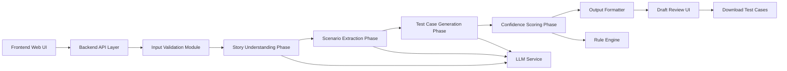

# Technical Design Document — Test Case Generation Agent

## 1. Document Purpose

This document defines the technical architecture, system design, and phased agent workflow for a **Test Case Generation Agent**. The application is intended to help users enter a **User Story Title**, **Description**, and **Acceptance Criteria**, and generate structured **draft test cases** for human review and download.

The design is based strictly on the validated decisions confirmed during the questionnaire process and the additional requirement to provide a **Download Test Cases** button in the UI.

---

## 2. Confirmed Scope and Design Decisions

### 2.1 Business Objective
Design a standalone web application that generates test cases from structured user story inputs.

### 2.2 Confirmed Functional Scope
The first release will generate the following test case types:

- Functional test cases
- Positive test cases
- Negative test cases
- Boundary validation test cases

### 2.3 Confirmed Output Structure
Each generated test case must contain:

- Test Case ID
- Test Case Title
- Test Type
- Preconditions
- Test Steps
- Test Data
- Expected Result
- Priority
- Confidence Score

### 2.4 Confirmed Input Method
The front end will support **manual entry only** for:

- User Story Title
- Description
- Acceptance Criteria

### 2.5 Confirmed Generation Strategy
The system will use a **multi-phase generation pipeline**.

### 2.6 Confirmed Confidence Model
Confidence scoring will use a **hybrid model**:

- LLM-based semantic confidence
- Rule-based validation confidence

### 2.7 Confirmed Review Model
The system will generate **draft test cases** and present them for **human review and approval**.

### 2.8 Confirmed Deployment Scope
The first version will be a **standalone web application only**.

### 2.9 Additional Confirmed UI Requirement
The generated test cases must be downloadable through a **Download Test Cases** button in the front end.

---

## 3. Product Vision

The Test Case Generation Agent is a domain-specific AI-assisted application that converts business requirements into reviewable QA artifacts. The system is not intended to auto-approve or auto-publish test cases. Its purpose is to improve test design productivity while preserving human control over final quality.

---

## 4. High-Level Architecture



### 4.1 Primary Components

- **Frontend Web UI**
  - Input form
  - Generate action
  - Draft test case review screen
  - Approval workflow
  - Download button for generated test cases

- **Backend API Layer**
  - Request orchestration
  - Phase execution
  - Validation
  - Prompt handling
  - Output assembly
  - Download payload preparation

- **LLM Service**
  - Requirement understanding
  - Scenario derivation
  - Test case drafting

- **Rule Engine**
  - Output structure checks
  - Traceability checks
  - Confidence adjustments

- **Review Layer**
  - Human validation before approval

- **Export Module**
  - Converts generated output into downloadable file format

---

## 5. Target Users

### Primary Users
- QA Analysts
- Test Engineers
- Product Owners
- Business Analysts
- Delivery Leads reviewing generated QA assets

### Usage Pattern
A user enters the user story details, submits the request, reviews generated draft test cases, optionally approves them, and downloads them for further testing lifecycle activities.

---

## 6. Frontend Architecture

## 6.1 Frontend Purpose
The front end captures structured requirement inputs and presents generated draft test cases in a reviewable and downloadable format.

## 6.2 UI Screens

### Screen 1: Test Case Generation Form
Fields:
- User Story Title
- Description
- Acceptance Criteria

Actions:
- Generate Test Cases
- Reset / Clear Form

### Screen 2: Generated Draft Test Cases
Displays:
- Generated test cases in standard QA structure
- Confidence score per test case
- Review status

Actions:
- Approve
- Reject
- Download Test Cases
- Return to edit input

## 6.3 Download Button Requirement

The screen displaying generated test cases must contain a **Download Test Cases** button.

### Recommended First-Version Download Format
- **CSV** as the primary format for broad usability and easy import into Excel or test management tools

### Optional Future Formats
- Excel (.xlsx)
- JSON
- PDF
- Markdown

### Download Scope
The button should download:
- All generated draft test cases currently displayed to the user
- Full test case structure including confidence score
- Review metadata if needed in later phases

## 6.4 Frontend Functional Requirements
- Mandatory field validation for all input fields
- Clear error messages for missing or invalid data
- Loading state during generation
- Display of generated draft test cases in structured cards or table format
- Review and approval status visibility
- Download button enabled only when test cases are successfully generated

## 6.5 Suggested Frontend Technology
Industry-standard standalone web stack:

- **React** or **Next.js** for UI
- **TypeScript** for maintainability
- **Component library** such as Material UI or equivalent
- **Form validation library** such as React Hook Form + Zod
- **State management** using local state or lightweight store

---

## 7. Backend Architecture

## 7.1 Backend Purpose
The backend orchestrates the full generation workflow. It receives user inputs, validates them, runs each agent phase, combines LLM and rule-based outputs, and returns structured draft test cases.

It also prepares the generated test cases in a downloadable structure for the frontend download action.

## 7.2 Suggested Backend Technology
Industry-standard stack:

- **Python FastAPI** or **Node.js** service
- REST-based APIs
- LLM integration adapter
- Modular orchestration service
- Rule engine service/module

Python FastAPI is recommended because it is well suited for:
- orchestration
- prompt assembly
- validation
- AI workflow services
- future extensibility
- export service generation

## 7.3 Backend Modules

### 7.3.1 API Controller
Receives requests from UI and returns generation results.

### 7.3.2 Input Validator
Checks:
- non-empty fields
- minimum content sufficiency
- malformed acceptance criteria formatting
- unsupported character or payload issues

### 7.3.3 Orchestrator
Coordinates all phases:
1. Story understanding
2. Scenario extraction
3. Test case generation
4. Confidence scoring
5. Output formatting
6. Export preparation

### 7.3.4 Prompt Manager
Stores and manages phase-specific prompts.

### 7.3.5 LLM Connector
Handles calls to the chosen LLM provider and normalizes responses.

### 7.3.6 Rule Engine
Applies deterministic checks:
- required field completeness
- coverage of acceptance criteria
- structure consistency
- confidence adjustment rules

### 7.3.7 Response Formatter
Converts final output into the agreed QA structure.

### 7.3.8 Export Formatter
Converts generated test cases into downloadable output.

Recommended phase-1 export format:
- CSV

---

## 8. Multi-Phase Agent Design

The system must operate as a **phased AI agent workflow** rather than single-pass text generation.

## 8.1 Phase 1 — Input Normalization
### Objective
Convert frontend input into a canonical internal structure.

### Inputs
- User Story Title
- Description
- Acceptance Criteria

### Outputs
Normalized requirement object:
```json
{
  "title": "string",
  "description": "string",
  "acceptance_criteria": ["string", "string"]
}
```

### Responsibilities
- trim whitespace
- standardize formatting
- split acceptance criteria into atomic items when possible

---

## 8.2 Phase 2 — Requirement Understanding
### Objective
Interpret the business intent of the user story.

### Responsibilities
- identify business goal
- identify primary actor or user
- identify feature behavior
- identify conditions, constraints, and validations
- identify ambiguity or missing information

### Output
A structured requirement understanding artifact:
```json
{
  "business_goal": "string",
  "actors": ["string"],
  "functional_behaviors": ["string"],
  "constraints": ["string"],
  "identified_validations": ["string"],
  "ambiguities": ["string"]
}
```

---

## 8.3 Phase 3 — Scenario Extraction
### Objective
Transform requirement understanding into testable scenarios.

### Scenario Categories
- Functional scenarios
- Positive scenarios
- Negative scenarios
- Boundary validation scenarios

### Output
```json
{
  "scenarios": [
    {
      "scenario_id": "SCN-001",
      "scenario_type": "Functional",
      "scenario_description": "string",
      "mapped_acceptance_criteria": ["AC-1", "AC-2"]
    }
  ]
}
```

### Responsibilities
- derive atomic test scenarios
- map scenarios to acceptance criteria
- avoid duplicate scenario creation
- explicitly identify edge and invalid-condition cases

---

## 8.4 Phase 4 — Test Case Generation
### Objective
Generate detailed draft test cases from extracted scenarios.

### Responsibilities
- produce one or more test cases per scenario where needed
- maintain the approved standard QA format
- ensure steps are executable and unambiguous
- ensure expected results are observable and testable

### Output Format
```json
{
  "test_case_id": "TC-001",
  "test_case_title": "Verify user can submit valid details",
  "test_type": "Positive",
  "preconditions": ["User is on the form page"],
  "test_steps": [
    "Enter valid values in all mandatory fields",
    "Click Generate Test Cases"
  ],
  "test_data": ["Valid title", "Valid description", "Valid acceptance criteria"],
  "expected_result": "System accepts the input and generates draft test cases",
  "priority": "High",
  "confidence_score": 0.0
}
```

---

## 8.5 Phase 5 — Confidence Scoring
### Objective
Compute a hybrid confidence score for each generated test case.

### 8.5.1 LLM-Based Confidence Inputs
- semantic relevance to requirement
- completeness of scenario interpretation
- quality of alignment between acceptance criteria and expected result
- clarity of generated steps

### 8.5.2 Rule-Based Confidence Inputs
- mandatory output fields present
- each test case mapped to at least one scenario
- test steps are non-empty and sequenced
- expected result is present
- test data is present where relevant
- acceptance criteria coverage is traceable

### 8.5.3 Recommended Hybrid Formula
```text
Final Confidence Score =
(0.60 × LLM Semantic Confidence) +
(0.40 × Rule-Based Validation Confidence)
```

### 8.5.4 Confidence Bands
- **0.85 – 1.00**: High confidence
- **0.70 – 0.84**: Moderate confidence
- **Below 0.70**: Needs careful human review

---

## 8.6 Phase 6 — Output Structuring and Review Packaging
### Objective
Return test cases in a UI-ready draft structure.

### Responsibilities
- attach review status
- group by test type if needed
- preserve traceability metadata for future enhancements
- prepare exportable data structure for download

### Final Response Shape
```json
{
  "status": "success",
  "draft_test_cases": [],
  "summary": {
    "total_test_cases": 0,
    "functional_count": 0,
    "positive_count": 0,
    "negative_count": 0,
    "boundary_count": 0
  },
  "download_supported": true,
  "download_format": "csv"
}
```

---

## 9. Copilot / Agent Prompt Design Structure

This section is specifically designed so the technical design can be fed into a copilot-style agent implementation.

## 9.1 System Role Prompt
```text
You are a QA-focused AI Test Case Generation Agent.
Your responsibility is to analyze a user story title, description, and acceptance criteria, and generate structured draft test cases.
You must generate only the following test types: Functional, Positive, Negative, and Boundary Validation.
You must produce output in the exact QA format provided.
You must not invent unsupported business facts.
You must preserve traceability to the user story and acceptance criteria.
You must assign a confidence score for each generated test case, which will later be combined with rule-based validation.
The output is draft quality and intended for human review and approval.
```

## 9.2 Phase Prompting Strategy

### Prompt for Phase 1: Normalize Inputs
```text
Normalize the provided user story title, description, and acceptance criteria into a clean internal structure.
Split the acceptance criteria into atomic points where possible.
Do not infer missing requirements.
```

### Prompt for Phase 2: Understand Requirement
```text
Analyze the normalized user story and extract:
- business goal
- actor
- functional behaviors
- constraints
- validations
- ambiguities

Do not hallucinate.
Only derive what is supported by the input.
```

### Prompt for Phase 3: Extract Scenarios
```text
From the requirement understanding output, derive testable scenarios.
Create scenarios under these categories only:
- Functional
- Positive
- Negative
- Boundary Validation

Map each scenario to the relevant acceptance criteria where possible.
Avoid duplicates.
```

### Prompt for Phase 4: Generate Test Cases
```text
Generate draft test cases from the extracted scenarios.

Each test case must include:
- Test Case ID
- Test Case Title
- Test Type
- Preconditions
- Test Steps
- Test Data
- Expected Result
- Priority
- Confidence Score

Do not omit fields.
Do not hallucinate unsupported flows.
Write steps clearly and in executable order.
```

### Prompt for Phase 5: Confidence Estimation
```text
Assign an LLM confidence score to each generated test case based on:
- requirement relevance
- scenario completeness
- clarity of expected result
- alignment with acceptance criteria

Return the score as a decimal between 0 and 1.
```

---

## 10. API Design

## 10.1 Generate Test Cases API
**Endpoint**
```http
POST /api/testcases/generate
```

**Request**
```json
{
  "title": "User can submit registration form",
  "description": "As a user, I want to submit a registration form so that I can create an account.",
  "acceptance_criteria": [
    "User must enter mandatory fields",
    "System should validate invalid email format",
    "System should show success after valid submission"
  ]
}
```

**Response**
```json
{
  "status": "success",
  "draft_test_cases": [],
  "summary": {
    "total_test_cases": 12,
    "functional_count": 4,
    "positive_count": 3,
    "negative_count": 3,
    "boundary_count": 2
  }
}
```

## 10.2 Download Test Cases API
**Endpoint**
```http
POST /api/testcases/download
```

**Purpose**
Convert generated test cases into a downloadable file.

**Recommended Request**
```json
{
  "format": "csv",
  "test_cases": []
}
```

**Recommended Response**
- file stream / downloadable payload
- filename example:
```text
generated_test_cases.csv
```

---

## 11. Data Model

## 11.1 Input Model
```json
{
  "title": "string",
  "description": "string",
  "acceptance_criteria": ["string"]
}
```

## 11.2 Scenario Model
```json
{
  "scenario_id": "string",
  "scenario_type": "string",
  "scenario_description": "string",
  "mapped_acceptance_criteria": ["string"]
}
```

## 11.3 Test Case Model
```json
{
  "test_case_id": "string",
  "test_case_title": "string",
  "test_type": "string",
  "preconditions": ["string"],
  "test_steps": ["string"],
  "test_data": ["string"],
  "expected_result": "string",
  "priority": "string",
  "confidence_score": 0.0,
  "review_status": "Draft"
}
```

---

## 12. End-to-End Flow

1. User opens the web application.
2. User enters:
   - User Story Title
   - Description
   - Acceptance Criteria
3. User clicks **Generate Test Cases**.
4. Backend validates the payload.
5. Orchestrator runs the multi-phase agent pipeline.
6. Test cases are generated and confidence-scored.
7. Draft test cases are returned to the UI.
8. User reviews the generated output.
9. User optionally approves or rejects draft test cases.
10. User clicks **Download Test Cases** to export the output.

---

## 13. Non-Functional Requirements

### Performance
- Generation should complete within acceptable interactive time for standard user stories.

### Reliability
- Invalid or incomplete requests must fail gracefully with clear messages.

### Maintainability
- Phase prompts and rules should be modular and version-controlled.

### Traceability
- Generated test cases should remain traceable to acceptance criteria.

### Usability
- UI should remain simple, professional, and reviewer-friendly.

---

## 14. Risks and Controls

### Risk 1: Hallucinated test cases
**Control:** strict prompt constraints + rule-based validation + human review

### Risk 2: Missing acceptance criteria coverage
**Control:** explicit scenario-to-acceptance-criteria mapping

### Risk 3: Poor output consistency
**Control:** structured response schema + formatter layer

### Risk 4: Weak trust in AI output
**Control:** confidence score + draft-only review model

---

## 15. Recommended Phase-1 Delivery Scope

### Included
- Web form input
- Multi-phase agent pipeline
- Draft test case generation
- Human review step
- Confidence scoring
- CSV download button

### Excluded for Phase 1
- Jira integration
- Azure DevOps integration
- Auto publishing to test management tools
- File upload input
- Role-based workflow
- Version history

---

## 16. Final Recommendation

The recommended first implementation is a **standalone web application** using:

- **Frontend:** React / Next.js + TypeScript
- **Backend:** FastAPI
- **AI Layer:** LLM-powered phased orchestration
- **Validation:** Hybrid confidence using LLM + rules
- **Review Pattern:** Draft with human approval
- **Export:** Download Test Cases button with CSV output in phase 1

This design provides a controlled, enterprise-friendly foundation for future expansion into integrated QA ecosystems.

---

## 17. Suggested Next Step

The next artifact that should ideally be created after this document is:

- **Frontend implementation `.md`**
- **Backend implementation `.md`**
- **API contract specification**
- **Prompt configuration file for each agent phase**
- **UI wireframe for form, review, and download flow**
